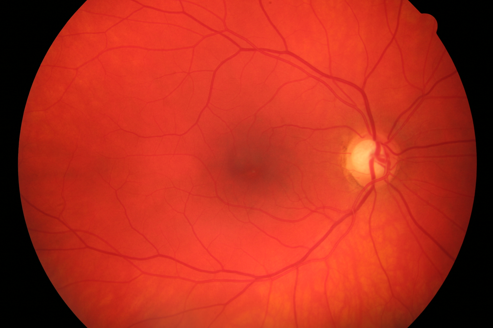
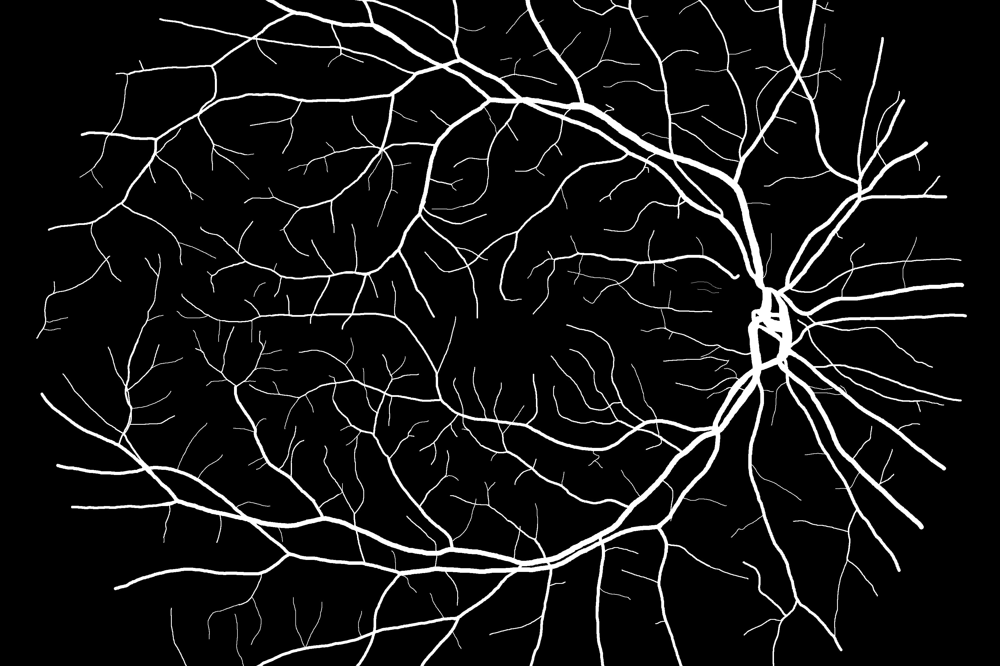
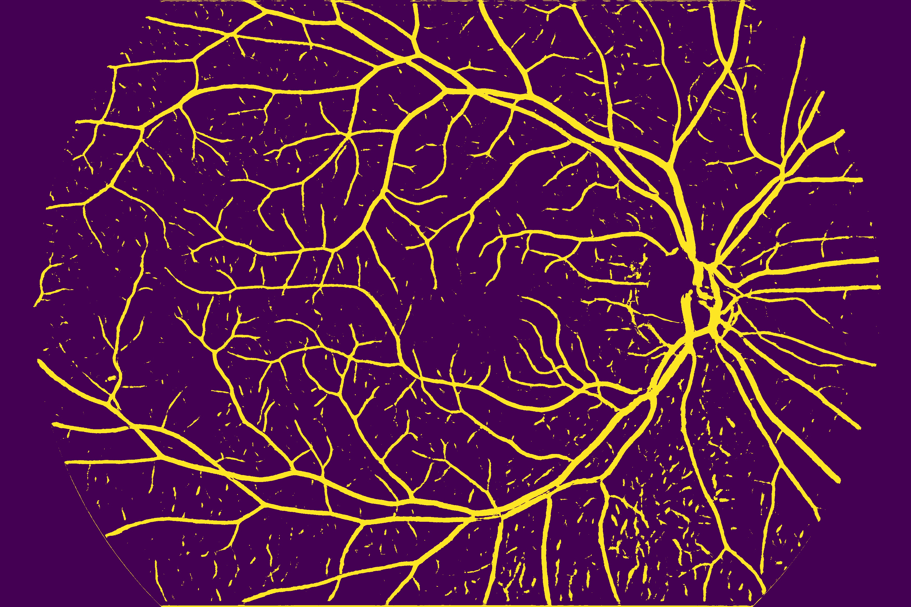
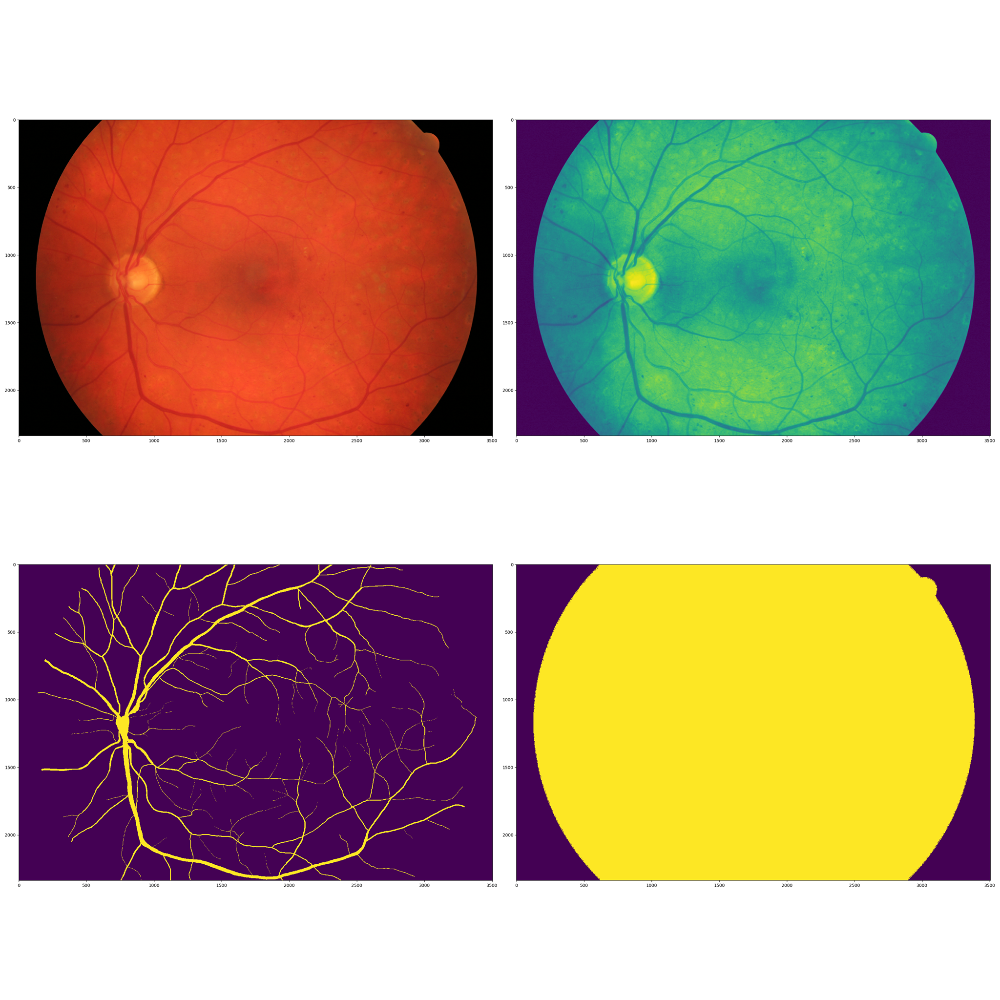
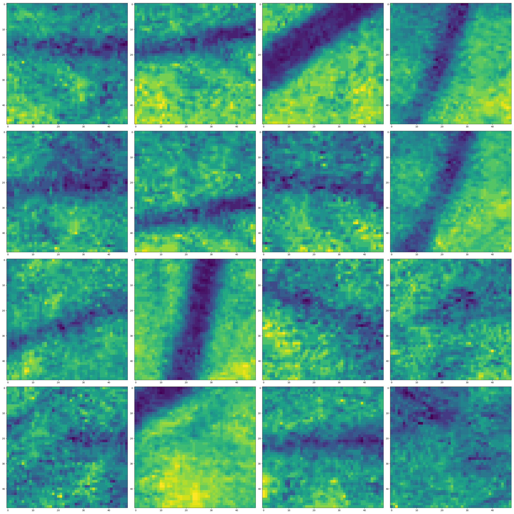
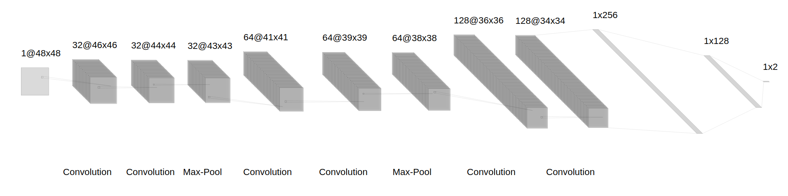

# Recognize eye blood vessels
This repo contains a convolution neural network that can predict if a pixel in the centre of patch 48x48 px is a vessel or not. Here is also a code to predict the whole image using this network.
I got 92% accuracy on the balanced dataset. For a better experience, I recommend using U-net ;)

### Results
Main image:

Manual prediction:

Neural network prediction:

### How it works
Read a manual prediction, a mask, the main image and improve it by using histogram equalization and logarithmic adaptation.
I keep this data in Tensor class:

Cut patches from the improved image and apply random undersampling. Collect 2500 patches from every image. 
Example patches:

Learn the neural network using the collected data ;)
